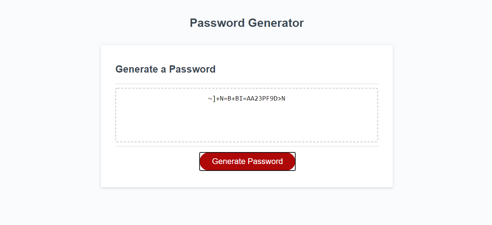

## Challenge 3 - Password Generator

## Purpose

To create randomly generated and secure passwords

## Task
In Challenge 3 the task was to create a password generator with the following requirements:
- Clicking the button will present user with password prompts
- Prompt for password length will appear on the screen
- 4 different criterias for a password: numbers, lowercase, uppercase, and special characters
- Password is displayed on the screen after selecting criterias

## Screenshot

## URL
https://thomasnguyen546.github.io/Password-Generator/
